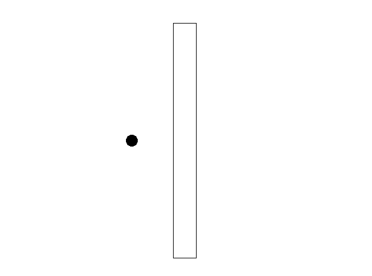

# SDL2 C Tutorial

This repository contains my C implementation of selected **Lazy Foo SDL2** tutorial examples, up to the **File Reading and Writing** section.  
Originally these tutorials are in C++, and I have adapted them to C while keeping the functionality and graphics intact.

---

 

---

## 📦 How to Run
1. Make sure you have **SDL2** installed on your system.  
2. Compile the C files using `gcc` or your preferred compiler.  
3. Run the executable files.

---

## ⚡ Highlights
- SDL2 graphics implemented in C  
- Adaptation from original C++ tutorials

---

*This project is based on the Lazy Foo SDL2 tutorials (https://lazyfoo.net/tutorials/SDL/) and adapted by me to C.*

